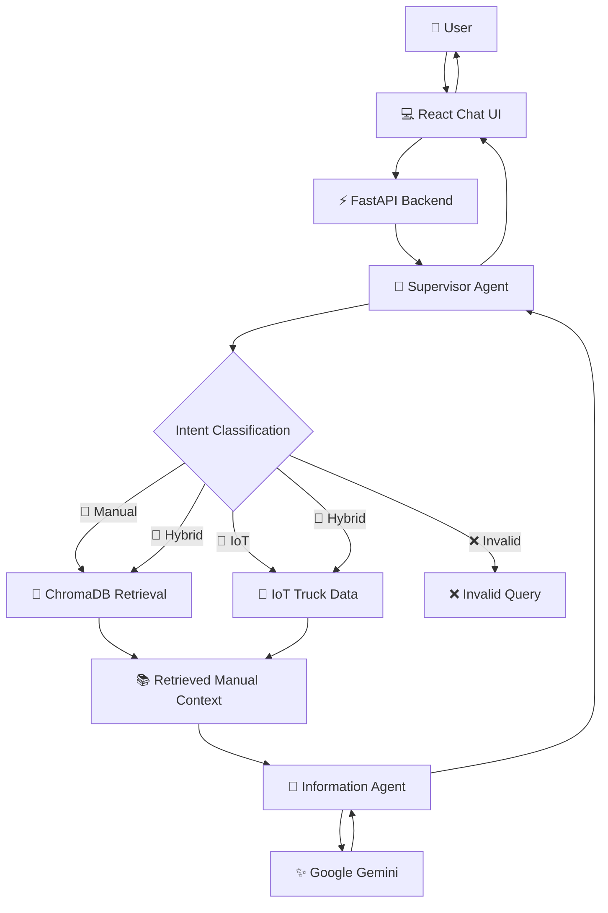
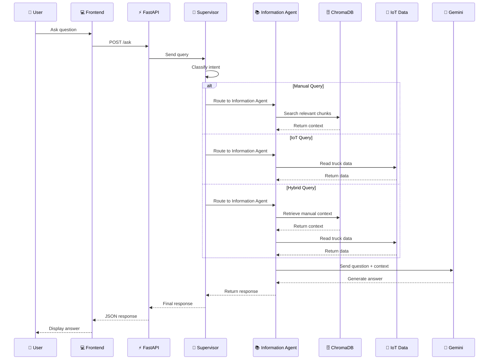

# 🚛 Fleet Manual AI Assistant

<p align="center">
  <b>🤖 An AI-powered assistant for fleet manuals, vehicle information, and live IoT data</b>
</p>

<p align="center">
  
  
  
  
  
</p>

---

## 🌟 Overview

**Fleet Manual AI Assistant** is a web-based AI chatbot designed to help users get information about fleet vehicles quickly and naturally.

Instead of manually searching through large vehicle manuals, users can simply ask a question in the chat interface. The system identifies the type of question, retrieves relevant information from the fleet manuals or IoT data, and uses **Google Gemini** to generate the final response.

The project combines **RAG (Retrieval-Augmented Generation)** with an **AI agent workflow** to provide context-based answers.

### 💡 What can it answer?

- 📖 Questions about fleet manuals
- 🔧 Maintenance-related information
- 🚛 Vehicle specifications
- 📡 Live/sample IoT truck information
- ⛽ Fuel-related information
- 🌡️ Engine temperature and sensor information
- 📍 Truck location and status
- 🔀 Questions requiring both manual + IoT information

---

## ✨ Key Features

### 🤖 1. AI-Powered Chat

Users can interact with the system through a simple chat interface.

```text
User: What is the fuel tank capacity of the Blazo X?

                ↓

        🧠 AI Processing

                ↓

      📚 Manual Retrieval

                ↓

          🤖 Gemini

                ↓

       💬 Final Answer
```

---

### 🧭 2. Intelligent Intent Classification

Before answering a question, the system identifies what type of information is required.

| Intent | Purpose |
|---|---|
| 📖 `manual` | Information available in the fleet manuals |
| 📡 `iot` | Current/sample truck IoT information |
| 🔀 `hybrid` | Requires both manual and IoT information |
| ❌ `invalid` | Question is outside the fleet-management domain |

The project uses **Sentence Transformers** and cosine similarity for intent classification, with a keyword-based fallback when the local embedding model is unavailable.

---

### 🧠 3. Supervisor + Information Agent

The backend uses a simple agent workflow built with **LangGraph**.

#### 👨‍💼 Supervisor Agent

The Supervisor Agent:

- Receives the user's query
- Checks whether the query is valid
- Classifies the intent
- Routes the query to the Information Agent

#### 📚 Information Agent

The Information Agent:

- Retrieves relevant manual information
- Reads truck IoT data when required
- Builds the context for the LLM
- Sends the context and question to Gemini
- Returns the generated answer

---

## 🏗️ System Architecture



---

## 🔎 RAG Pipeline

The project uses **Retrieval-Augmented Generation (RAG)** to answer questions using information from the provided fleet manuals.

### 📚 Document Processing

The manual-processing pipeline performs the following steps:

```text
PDF Manuals
    │
    ▼
📄 PDF Parsing
    │
    ├── Text Extraction
    ├── Table Extraction
    └── OCR for scanned content
    │
    ▼
🧹 Text Cleaning
    │
    ▼
✂️ Semantic Chunking
    │
    ▼
🧠 Embeddings
    │
    ▼
🗄️ ChromaDB
    │
    ▼
🔎 Similarity Search
    │
    ▼
📚 Relevant Context
    │
    ▼
🤖 Gemini
    │
    ▼
💬 Final Answer
```

The current project includes:

- `manual.pdf`
- `blazo-brochure.pdf`

These documents are processed and stored in the ChromaDB vector store.

---

## 📡 IoT Data

The project also contains truck data in:

```text
iot_data/trucks.json
```

This data can be used for questions related to:

- ⛽ Fuel
- 🌡️ Temperature
- 📍 Location
- 🚗 Speed
- 📊 Truck status
- 📡 Telemetry

Example questions:

```text
What is TruckA's current fuel level?

Where is TruckA currently located?

What is TruckB's engine temperature?

Which truck has the highest engine temperature?

Show the current fleet status.
```

---

## 🛠️ Tech Stack

### 🎨 Frontend

- ⚛️ **React 19**
- ⚡ **Vite**
- 🎨 **Tailwind CSS**
- 📡 **Axios**
- 🟨 **JavaScript**

### ⚙️ Backend

- 🐍 **Python**
- 🚀 **FastAPI**
- 🧩 **LangGraph**
- 🔗 **LangChain**
- 🤖 **Google Gemini**
- 🧠 **Sentence Transformers**
- 📐 **scikit-learn**
- 🔢 **NumPy**

### 📚 RAG & Document Processing

- 🗄️ **ChromaDB**
- 📄 **PyPDF**
- 📊 **pdfplumber**
- 🖼️ **PyMuPDF**
- 🔤 **Tesseract OCR**
- 🧠 **Google Generative AI Embeddings**

---

## 📁 Project Structure

```text
FleetManualDivya/
│
├── 📂 backend/
│   │
│   ├── 📂 agents/
│   │   ├── information_agent.py
│   │   ├── supervisor_agent.py
│   │   └── workflow.py
│   │
│   ├── 📂 graph/
│   │   ├── state.py
│   │   └── workflow.py
│   │
│   ├── 📂 services/
│   │   └── intent_classifier.py
│   │
│   ├── 📂 chromadb/
│   │   └── Vector database
│   │
│   ├── 📂 testingFiles/
│   │   └── Testing and experimentation files
│   │
│   ├── main.py
│   └── store.py
│
├── 📂 frontend/
│   │
│   ├── 📂 src/
│   │   ├── 📂 components/
│   │   │   ├── ChatWindow.jsx
│   │   │   ├── InputBox.jsx
│   │   │   ├── Message.jsx
│   │   │   ├── Navbar.jsx
│   │   │   └── Sidebar.jsx
│   │   │
│   │   ├── 📂 pages/
│   │   │   └── Home.jsx
│   │   │
│   │   ├── 📂 services/
│   │   │   └── api.js
│   │   │
│   │   ├── App.jsx
│   │   └── main.jsx
│   │
│   ├── package.json
│   └── vite.config.js
│
├── 📂 iot_data/
│   └── trucks.json
│
├── 📂 manuals/
│   ├── manual.pdf
│   └── blazo-brochure.pdf
│
├── 📄 requirements.txt
├── 📄 main.py
└── 🔐 .env
```

---

## 🚀 Getting Started

### 📌 Prerequisites

Make sure the following are installed:

- 🐍 Python 3.10+
- 🟢 Node.js
- 📦 npm
- 🔑 Google Gemini API key

---

## ⚙️ Backend Setup

### 1️⃣ Clone the repository

```bash
git clone <your-repository-url>
cd FleetManualDivya
```

### 2️⃣ Create a Python virtual environment

#### Windows

```bash
python -m venv venv
venv\Scripts\activate
```

#### macOS / Linux

```bash
python3 -m venv venv
source venv/bin/activate
```

### 3️⃣ Install Python dependencies

```bash
pip install -r requirements.txt
```

### 4️⃣ Configure environment variables

Create a `.env` file in the project root and add your Google API key:

```env
GOOGLE_API_KEY=your_google_api_key
```

> 🔐 **Important:** Never upload your API key or `.env` file to GitHub.

### 5️⃣ Start the backend

From the project root:

```bash
uvicorn main:app --reload
```

The backend will be available at:

```text
http://127.0.0.1:8000
```

API documentation:

```text
http://127.0.0.1:8000/docs
```

---

## 💻 Frontend Setup

Open another terminal:

```bash
cd frontend
```

Install dependencies:

```bash
npm install
```

Start the development server:

```bash
npm run dev
```

The frontend will normally run at:

```text
http://localhost:5173
```

---

## 🔌 API

### `GET /`

Checks whether the backend is running.

Example response:

```json
{
  "message": "Fleet Management AI Backend Running"
}
```

### `POST /ask`

Sends a user question to the AI workflow.

Request:

```json
{
  "question": "What is the fuel tank capacity of the Blazo X?"
}
```

The backend processes the question through the agent workflow and returns the generated answer.

---

## 🧪 Example Queries

### 📖 Manual Queries

```text
What is the GVW of the Blazo X 28 Cargo?

What engine powers the Blazo X?

What is the fuel tank capacity?

What is the maximum engine power?

What safety features are available?

What is FuelSmart technology?
```

### 📡 IoT Queries

```text
What is TruckA's current fuel level?

What is TruckB's engine temperature?

Where is TruckA currently located?

Which truck is moving the fastest?

Which truck needs immediate attention?
```

### 🔀 Hybrid Queries

```text
What is the current truck status and what should be checked if the temperature is high?

Based on the truck data, what maintenance information should I refer to?
```

---

## 🔄 Agent Workflow



---

## 🧩 Important Components

| Component | Responsibility |
|---|---|
| 🧭 Supervisor Agent | Validates and classifies user queries |
| 📚 Information Agent | Collects required information and generates context |
| 🔎 Intent Classifier | Detects manual, IoT, hybrid, or invalid queries |
| 🗄️ ChromaDB | Stores and retrieves manual embeddings |
| 📄 Store Pipeline | Parses, chunks, embeds, and stores manuals |
| 🤖 Gemini | Generates the final natural-language response |
| 📡 IoT Data | Provides truck telemetry/sample data |
| 💻 React UI | Provides the chat interface |

---

## 🔐 Security Notes

- Keep API keys inside `.env`.
- Do not commit secrets to GitHub.
- Add `.env` to `.gitignore`.
- Use environment variables for API credentials.
- Review the sample IoT data before deploying the application publicly.

---

## 🚧 Future Improvements

Some useful improvements for future versions:

- 🔐 Add user authentication
- 📤 Add manual/PDF upload from the UI
- 📡 Connect to real-time IoT devices
- 💬 Store conversation history
- 📌 Add source/page citations to RAG responses
- 📊 Add fleet analytics dashboard
- 🚨 Add alerts for abnormal truck conditions
- ☁️ Deploy frontend and backend to the cloud
- 🧪 Add automated evaluation for RAG responses
- 🎯 Improve intent classification with more training examples

---

## 🎯 Project Goal

The main goal of this project is to make **fleet information easier and faster to access**.

Instead of searching through multiple manuals or checking different sources manually, the user can ask a question in natural language and let the AI workflow find the required information.

> 🚛 **Ask. Retrieve. Reason. Respond.**

---

## 👨‍💻 Project

**Fleet Manual AI Assistant**

Built using:

`React` • `FastAPI` • `LangGraph` • `RAG` • `ChromaDB` • `Sentence Transformers` • `Google Gemini`

---

<p align="center">
  ⭐ If you find this project useful, consider giving it a star!
</p>
